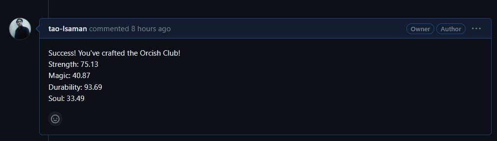
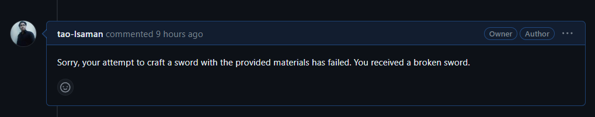
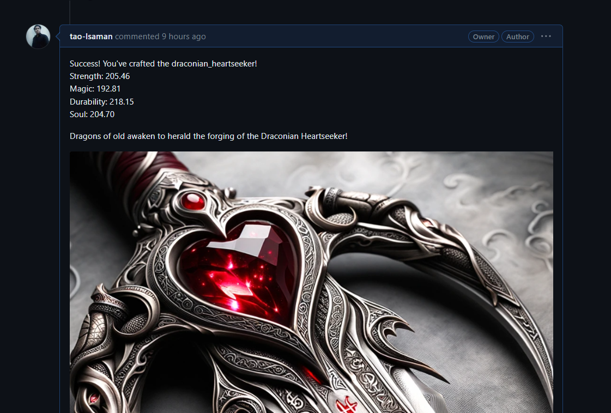

# ⚔️ craft-your-sword ⚔️

Welcome to the Sword Crafting Simulator repository. Here, developers can test their mettle and try to craft the ultimate sword using unique materials, and see the outcome of their chosen combinations!

## Table of Contents

1. [Features](#features)
2. [Getting Started](#getting-started)
3. [Usage](#usage)
4. [Sword Recipes](#sword-recipes)
5. [Materials Information](#materials-information)
6. [Examples of Swords](#examples-of-swords)
7. [Example of Json file](#example-of-json-file)

## Features

- **Crafting Mechanism**: Use unique materials to craft swords with varying strengths and abilities.
- **Github Actions**: PRs are automatically evaluated for sword crafting outcomes.
- **Dynamic Results**: Depending on the materials used, craft rare, common, or even broken swords.

## Getting Started

1. **Clone the Repo**: `git clone https://github.com/tao-Isaman/craft-your-sword.git`
2. **Navigate to the directory**: `cd craft-your-sword`

## Usage

1. Create a new PR.
2. In your PR, submit a `.json` file with your github username as a filename like `tao-Isaman.json` to the `/craft_recipes/` directory. This file should specify the materials you'd like to use for crafting your sword.
3. Wait for Github Actions to process your PR.
4. See the result as a comment in your PR!

## Sword Recipes

Check out our [SWORD_RECIPES.md](SWORD_RECIPES.md) to see available sword recipes and their required materials.

## Materials Information

Discover the properties and strengths of each material in the [MATERIALS.md](MATERIALS.md).

## Examples of Swords
- **The Ordinary Blade**: A symbol of power and elegance.
  

- **The Broken Hilt**: Not every attempt yields success. Sometimes, you might end up with this.
  

- **The Rare Gem**: Only the luckiest and most skilled crafters manage to forge such a masterpiece.
  

## Example of Json file 
Please create a PR with a JSON file named after your GitHub username, such as tao-Isaman.json, and place it inside the craft_recipes folder.

this is example :

```json
{
    "chosen_materials": [
        "dragon_scale",
        "vampire_fang",
        "wyvern_bone",
        "orcish_steel"
    ]
}
```